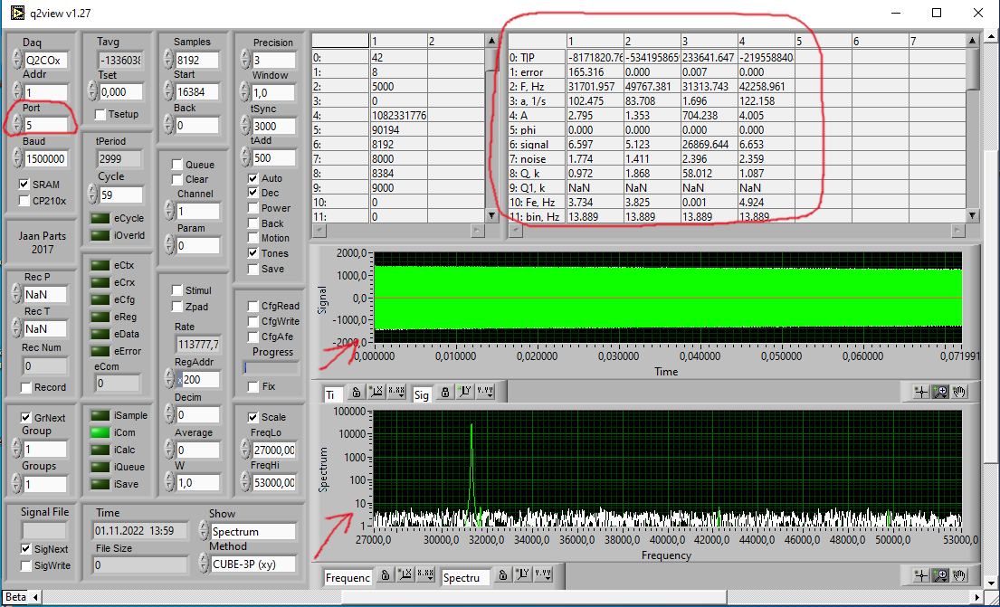
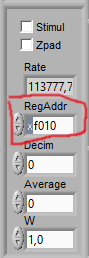
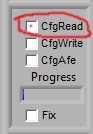
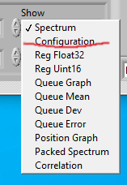
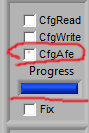
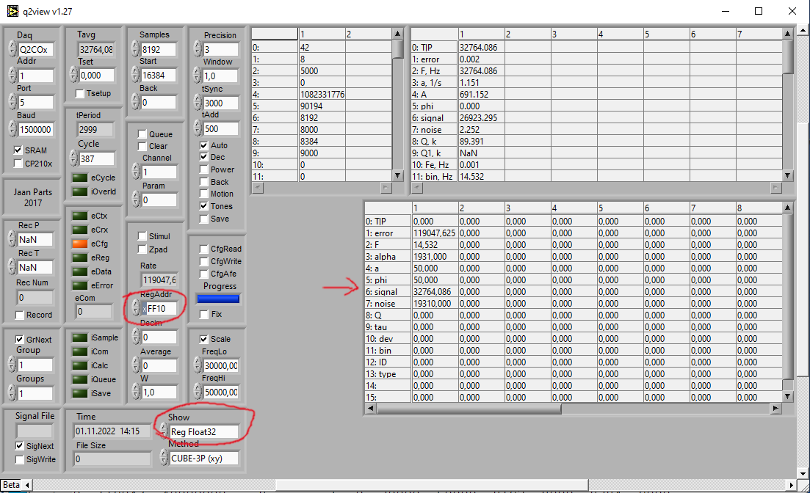

# Тестовая программа чтения данных с "Косы"

## Подготовка
1. Прошить настройки в "косу"
    1. Открыть Q2View
    2. Выбрать порт на 1 меньше чем номер COM-порта устройства, должны появиться цыфры, спектр и график.
    
    2. Установить в поле адрес 0xF080
    
    3. Загрузить настройки из файла
    
    4. Перейти в режим конфигурации 
    5. Нажать "CfgAfe", заполнится прогресс-бар 
2. Проверка
    1. Ввезти адрес 0xFF10
    2. Переключиться на режим "Reg Float32"
    3. В таблице должны отобразиться числа, подобные этим, а не NaN
    

## Использование
- Настройки COM-порта: 1500000 бод, 8-N-1
- Обмен по протоколу ELAM, это расширение ModbusRTU, адреса начинаются с __0xFB01__, позволяет читать и записывать большие наборы данных за раз.
- В целях отладки, некоторые сомбинации Адрес:Длина являются "магическими", тоесть устройство будеот отвечать именно на такой запрос, но если изменить длину или начальный адрес - будет совершенно другой результат или совсем не то что запрашивалось. В частности, результат, который нас интересуют внутри блока __0xFF10__ -> 256 ячеек.
- Порядок работы
1. Отправить магический запрос `[00 64 03 03 00 00 FF 17 20]`, он инициализирует начало измерительного цыкла
2. Ожидать измерение - около 300 мс.
3. Отправить запрос `[F8 01 03 FF 10 01 00 17 5F]`
4. Для верности подожлать 20 мс.
5. Считать ответ (таймаут 50мс).
6. По неясной причине длина получаемого ответа меньше ожидаемой, но это не важно там всерано нули
7. Выделить из ответа байты `[5..(5+4*8)]`, это 8 `f32`.
8. Преобразовать полученные данные в массив f32 путем перестановки байтов в каждой четверке
    было : `[d0 d1 d2 d3]`
    стало: `[d1 d0 d3 d2]` -> f32
9. Расчитанная частота резонанса находится в значении 6 (`_signal`), остальные - колдунство.

## Примеры
- `kosa-test.rs` - пример чтения данных с устройства
- `kosa-plot.rs` - пример чтения данных с устройства и построения графика, используя [livechart](https://github.com/ololoshka2871/livechart)
```bash
cargo run --example <example> [--release] -- --port <port> [..args]
```